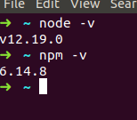
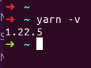
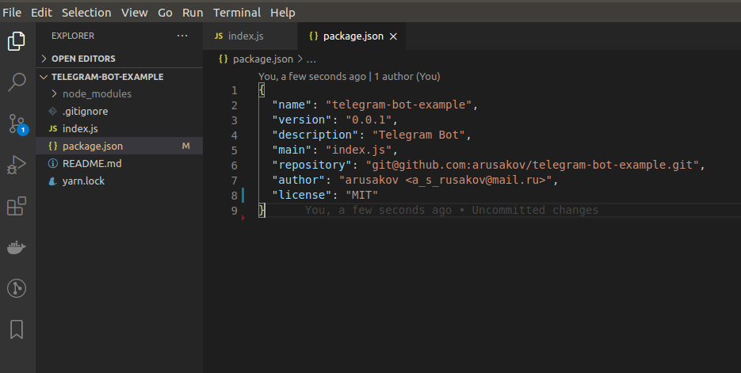

# Домашнее задание к занятию «1.1  Начало работы с Node.js»

### Подготовьте рабочую среду для дальнейшей работы

#### 1. Установите Node.js

Что вы должны увидеть в итоге шага

  

#### 2. Проверьте доступность npm и yarn

Что вы должны увидеть в итоге шага

#### 3. Инициализируйте проект с npm или yarn в VS Code.

Что вы должны увидеть в итоге шага

Это самостоятельное домашнее задание, его выполнение пригодится для следующих занятий.
